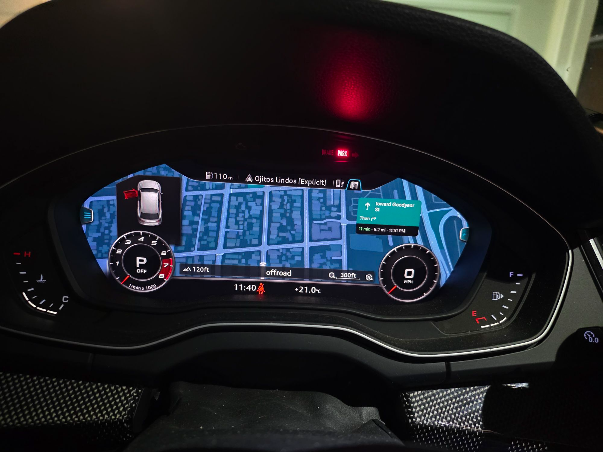
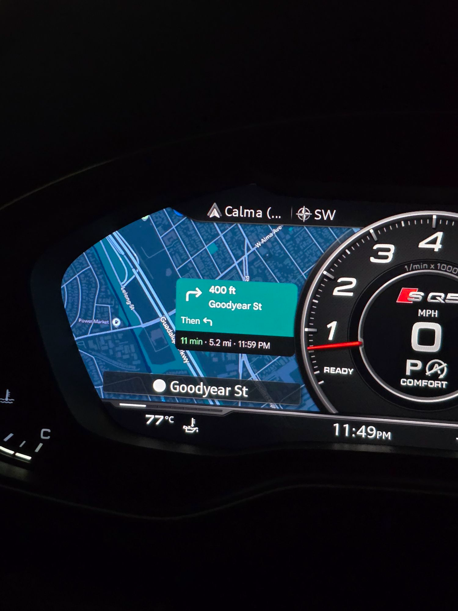

# MIB2Q Android Auto Cluster

> [!IMPORTANT]
> This is an **Android Auto** project built from two earlier open-source foundations:
>
> - **[LuKa's stack](https://github.com/luka-dev/mib2q-carplay-rgi)** is the foundation for the HUD,
>   turn arrows, lane guidance, maneuver renderer and Virtual Cockpit window/context handling.
> - **[OneB1t/chopinwong01's approach](https://github.com/chopinwong01/mhi2-android-auto-video-vc)**
>   came first for Android Auto cluster video: hook the stock receiver, advertise a second cockpit
>   display and accept the phone's independent H.264 stream.
>
> This fork combines and ports those foundations to Audi MHI2Q MU0918, then adds the Qualcomm decoder,
> 1080p 1:1 viewport, live cockpit layouts, Android Auto event bridge, steering-wheel controls and a
> firmware-gated M.I.B. installer. Both upstream projects retain full credit and history.

This project provides native Android Auto map video, route guidance and HUD integration for Audi
MHI2Q. It was developed and validated on a 2018 B9 SQ5 with `MHI2Q_US_AUG22_P3639`, MU0918 and the
first-generation Virtual Cockpit.

**The ready-to-install profile in this branch is specifically for MU0918.** The underlying framework
is intentionally reusable across MHI2Q releases: adapting another version normally means verifying a
small set of GAL/receiver ABI seams, regenerating the firmware-facing Java seams and adding that
firmware's hashes to a profile. The stream, decoder, cockpit layouts, HUD integration, controls,
renderer and installer logic do not need to be reinvented.

The phone creates a real second Android Auto display. It sends an independent H.264 cluster stream on
channel 64 while the centre display remains available for music, calls, messages or Android Auto's
guidance list. This is not a copy of the centre-screen framebuffer.

## Current result

- Separate 1920x1080 Android Auto cluster stream, negotiated with GAL protocol 4.3.
- Google Maps and Waze rendered natively for the cockpit.
- Qualcomm `OMX.qcom.video.decoder.avc` hardware decoding with automatic FFmpeg fallback.
- 1440x540 phone viewport presented 1:1 in the Virtual Cockpit.
- Live Large, Classic and Sport layouts through Android Auto message `0x8009`.
- Steering-wheel cockpit options menu with UI size, map theme, arrow tile and map position; the roller
  adjusts the car position (Large) and card layout (Sport).
- Turn arrows, distance and lane information in the Virtual Cockpit and HUD.
- Android Auto cover art, touchpad navigation and parking-popup integration.
- Feature off switches, conservative installation, log collection and exact uninstall rollback.

The most recent on-car validation sustained approximately 29–30 decoded frames per second and
24–27 displayed frames per second in the normal 1:1 view.

## Gallery

**Android Auto's independent map stream on the SQ5**

<p align="center">
  
  
</p>

More verified Android Auto screenshots and GIFs—including HUD, lane guidance, album art, cockpit
layouts and parking behavior—will be added from this car. The inherited CarPlay gallery remains in
the repository as upstream history but is intentionally not presented here as Android Auto evidence.

## Comparison

The figures for this project are measured on the SQ5 or verified in its source and logs. RoadKernel
details are limited to the package and demonstrations available during this research; values that were
not published are identified as such. LuKa's column describes the upstream CarPlay project rather than
the Android Auto additions in this fork.

| Capability | This project | RoadKernel | [LuKa (CarPlay)](https://github.com/luka-dev/mib2q-carplay-rgi) |
| --- | --- | --- | --- |
| **Phone system** | Android Auto | Android Auto | CarPlay |
| **Live map in the cockpit** | Yes. Android Auto's own cockpit stream, independent of the centre screen | Yes, independent of the centre screen | No projected map; turn guidance is drawn over Audi's native map |
| **Stream** | 1080p at 30 fps, with a 1440×540 viewport shown 1:1 | 720p at 30 fps, scaled | n/a |
| **Video decoding** | Qualcomm hardware decoder with automatic FFmpeg fallback | Hardware decoder | n/a |
| **Frames shown** | Approximately 24–27 of the 30 frames sent each second | Not published | n/a |
| **Sharpness and UI size** | Five sizes at 1080p: 95/110/125/140/160 DPI (Small to XX-Large). Large, 125 DPI, is the default and matches the cockpit's physical ~125 PPI | Not published | n/a |
| **Cockpit views** | Large, Classic and Sport, each with its own layout and live switching | Large, Classic and Sport | Guidance overlay follows the supported Audi layouts |
| **Google card beside Audi's arrow tile** | Yes | Yes | n/a |
| **HUD** | Turn arrows, distance and lanes | No | Turn arrows and distance from CarPlay |
| **Cockpit arrow tile** | Turn arrow, street and 16-step distance bars; selectable always-on or Audi-style behavior | Stock Audi tile | Stock Audi tile |
| **Lane guidance** | Cockpit and HUD | Not published | Yes, from CarPlay |
| **Steering-wheel menu** | Size, map position, arrow tile, resolution and Day/Night/Auto theme; opens with a two-second hold of the right arrow or the button left of the roller | No | No |
| **Day/night map** | Fixed Day or Night; Auto (follows the headlights) is in testing | Not published | n/a |
| **Map roller** | Adjusts car position in Large and card layout in Sport | No zoom | n/a |
| **MMI touchpad** | Swipes navigate Android Auto menus while handwriting remains available | Not published | Not published |
| **Album art** | Yes. Android Auto cover art appears in Audi's media screens | Not published | Yes for CarPlay; this implementation builds on LuKa's work |
| **Navigation apps tested** | Google Maps and Waze | Google Maps | Apple Maps |
| **Firmware represented here** | MU0918, tested on the car | MU1316 package examined | MU1316 releases; firmware-specific rebuilds may be required |
| **Installation** | SD card through M.I.B.; automatic logs, audit, off switch and exact uninstall rollback | SD card and rollback package; package observed tied to the vehicle VIN | SD card through M.I.B. |
| **Price and licence** | Free, GPL-3.0-or-later | Commercial, €100 at the time examined | Free; GPL-3.0 announced upstream and publication permission granted |

### Why 125 DPI

The first-generation Virtual Cockpit panel is 12.3 inches at 1440×540, about 125 pixels per inch. The
phone's picture is shown 1:1, so at 125 DPI Google's text, icons and lines land on the panel at their
intended physical size with no rescaling. Larger sizes (140 and 160 DPI) are available for a closer,
bigger look; they still render natively and stay sharp. Size changes apply on the next phone
connection.

## Known limits

- **No real map zoom.** Android Auto does not let the car zoom the cockpit map. Resizing the layout
  area only moves the car (Large) or changes Google's card size and layout (Sport). Map and text scale
  come from the Size setting.
- **Frame rate.** The phone sends 30 frames per second and all are decoded in hardware; about 24–27 per
  second reach the cockpit in normal use.
- **Settings that need a reconnect.** Size and Resolution are negotiated when the phone connects.
  Map theme, arrow tile and map position apply live.
- **Arrow buttons.** Holding the right arrow to open the menu can also open Audi's own side menu,
  because the cockpit reads that button itself.
- **Firmware.** Only MU0918 is validated. Other versions need a port; see below.

## FAQ

**Does it work on MHI2 (not MHI2Q)?** No. MHI2 is the older Nvidia-based unit (K-train firmware such
as `MHI2_US_AUG22_K2162`). This project targets the Qualcomm-based MHI2Q (P-train firmware). The
hardware video decoder and the Android Auto hook are specific to MHI2Q.

**Does it work on my MHI2Q with different firmware?** Possibly, after a port. Run the read-only
firmware checker below on files from your unit; it reports whether a validated profile matches.

**CarPlay? MIB3?** No. This project is Android Auto on MHI2Q. For CarPlay turn guidance, see
[LuKa's upstream project](https://github.com/luka-dev/mib2q-carplay-rgi). MIB3 (2020+) is a different
platform.

**Wired or wireless Android Auto?** Both have been tested: direct wired USB Android Auto and wireless
Android Auto through a USB adapter. They use the same receiver and cockpit-stream pipeline.

**Which navigation apps?** Any app that supports Android Auto's cockpit display. Google Maps and Waze
are tested.

## Supported firmware

| Firmware | Status | Work required |
| --- | --- | --- |
| `MHI2Q_US_AUG22_P3639` MU0918 | **Validated on the car; ready profile included** | Build with the owner's matching firmware JARs, stage and install |
| Other Audi MHI2Q releases | **Framework-compatible; profile verification required** | Verify the small native/Java seams, add hashes and test on that firmware |

### What is already portable

The substantial work is shared by every port:

- Android Auto secondary-display negotiation and channel 64 transport;
- 1080p/720p stream configuration and live `0x8009` cockpit layouts;
- Qualcomm H.264 decoding, FFmpeg fallback, bounded frame queue and 1:1 presentation;
- Large, Classic and Sport viewport logic, steering-wheel controls and menu;
- Android Auto route-event translation into LuKa's cockpit, lane-guidance and HUD stack;
- maneuver rendering, album art, touchpad and parking-popup integration;
- firmware checker, API/member gates, host tests, guarded installer and exact rollback.

### What changes for another firmware

Most MHI2Q adaptations should be a focused compatibility port rather than a new implementation:

1. Run the checker against `gal`, `libautoreceiver.so`, `lsd.jxe` and JARs obtained from that unit.
2. Confirm the receiver's interposed symbols, C++ object layouts and callback signatures used by the
   hook. If they match MU0918, the native change may be profile-only.
3. Regenerate and review the three firmware-facing Android Auto Java seams, then let the build compare
   every replaced class header and public/protected member with the supplied stock JAR.
4. Confirm the Virtual Cockpit terminal, window IDs and display contexts, add the firmware hashes and
   POSIX checksums to a new profile, and run the existing host/on-car validation sequence.

See [porting another firmware](docs/android-auto/firmware-porting.md) for the exact workflow. The
installer deliberately refuses an unverified version until this short compatibility pass has been
completed; that refusal protects the head unit and does not imply the framework must be rewritten.

Run the read-only checker against files obtained from the target unit:

```bash
python scripts/check_firmware.py \
  --gal /path/to/gal \
  --receiver /path/to/libautoreceiver.so \
  --lsd-jxe /path/to/lsd.jxe \
  --stock-jar /path/to/lsd.jar \
  --compile-jar /path/to/lsd_ic.jar
```

The checker is read-only. It reports `validated-profile`, `port-required`, `unsupported` or
`incomplete`, and lists every change the installer would make. Firmware binaries and converted stock
JARs are never stored in this repository.

## Repository layout

| Path | Purpose |
| --- | --- |
| `android_auto/hook/` | GAL/libautoreceiver hook, channel transport, OMX/FFmpeg player and host tests |
| `android_auto/java/` | Android Auto event bridge, cockpit/HUD integration, menu and firmware Java seams |
| `android_auto/deploy/` | Standalone GAL launcher and renderer supervision |
| `firmware/profiles/` | Public hashes and sizes for validated firmware; no firmware content |
| `install_AndroidAuto_MoreIncredibleBash/` | M.I.B. audit/install/uninstall entrypoint |
| `scripts/` | Compatibility checker, reproducible builds and SD-card staging |
| `common/`, `maneuver_render/`, `toolchain/` | Shared LuKa renderer foundation retained from upstream |
| `docs/android-auto/` | Architecture, installation, porting and validation notes |

The inherited CarPlay implementation remains in the working tree as upstream reference so fixes can
still be contributed cleanly to LuKa. Android Auto development and packaging are isolated under the
paths above on `android-auto-mu0918`; the Android Auto installer never deploys the CarPlay hook.

## Build

The build uses the QNX 6.5 ARMv7 Docker toolchain from
[`luka-dev/qnx65-armv7-toolchain`](https://github.com/luka-dev/qnx65-armv7-toolchain). Build that image
once, then run:

```bash
./scripts/build_android_auto_native.sh
./scripts/build_renderers.sh
./scripts/build_android_auto_java.sh \
  --stock-jar /private/path/lsd.jar \
  --compile-jar /private/path/lsd_ic.jar
python scripts/stage_android_auto.py
```

`lsd.jar` and `lsd_ic.jar` must be created from firmware owned by the builder. The Java build checks
every replaced class against that input and fails if a public/protected member or class header differs.
Compile-only stubs are checked so they cannot leak into the shipped overlay.

The generated SD folder is `dist/android-auto-card`. Build outputs and private firmware inputs are
ignored by Git.

## Installation

1. Make a complete M.I.B. backup of the unit.
2. Copy `install_AndroidAuto_MoreIncredibleBash` from the staged output to the M.I.B. SD card.
3. Run the custom script with no marker. It performs a **read-only audit** and prints the exact plan.
4. If the result says `VALIDATED MU0918 PROFILE`, create an empty `mib2q_aa_install` file in the SD root
   and run the script again.
5. Remove the marker, disconnect the phone and reboot the MMI.

To uninstall, use `mib2q_aa_uninstall` instead. The installer restores the configuration it backed up
and removes only files it added. See [installation details](docs/android-auto/installation.md) and
[on-unit changes](docs/android-auto/on-unit-changes.md).

## Upstream and attribution

This repository is a fork of [`luka-dev/mib2q-carplay-rgi`](https://github.com/luka-dev/mib2q-carplay-rgi).
LuKa's project supplied the MHI2Q cockpit integration, renderer, build foundation and selected assets.
The Android Auto cluster protocol work, GAL integration, channel 64 video pipeline, Qualcomm decoder,
MU0918 port, dynamic layouts and Android Auto controls were developed for this project.

The Android Auto hook also adapts GPL-3.0 work from OneB1t/chopinwong01's
`mhi2-android-auto-video-vc`. FFmpeg is used under LGPL-2.1-or-later. See
[`android_auto/THIRD_PARTY.md`](android_auto/THIRD_PARTY.md) and [`LICENSES/README.md`](LICENSES/README.md).

## License

This project is published under GPL-3.0-or-later, with the third-party exceptions and notices described
in [`LICENSES/README.md`](LICENSES/README.md). LuKa gave written permission on 2026-09-30 to publish and
distribute these Android Auto modifications as a fork of his project; the repository records the scope
without publishing the private correspondence or email addresses.

## Safety boundary

The installer does not replace `gal`, `libautoreceiver.so`, `lsd.jxe` or `gal.json`. It adds an overlay
JAR and runtime files, then changes only `children.gal.exec` and `children.gal.path` in
`smartphone_integrator.json`. Unknown firmware, an existing third-party GAL launcher, a damaged
payload or an externally edited installed configuration causes a refusal before activation.
