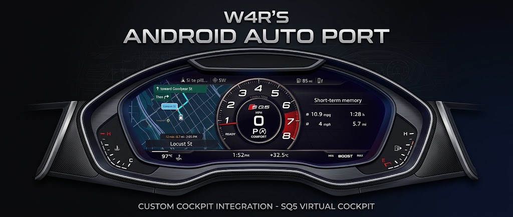
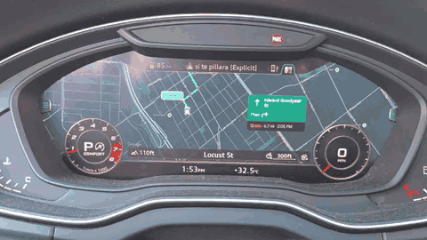
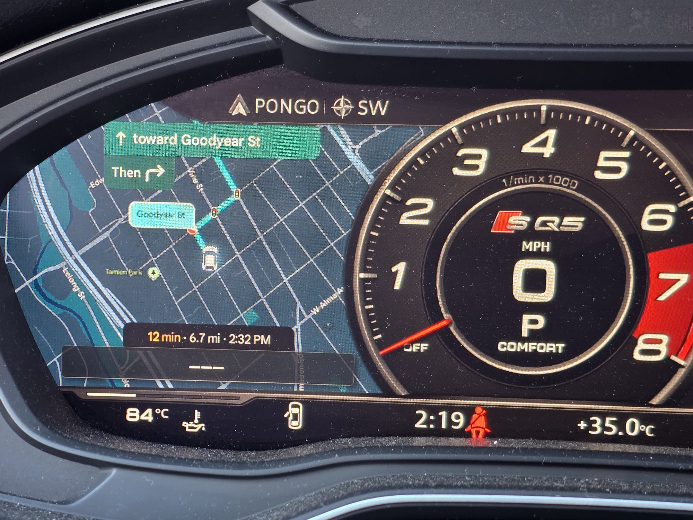
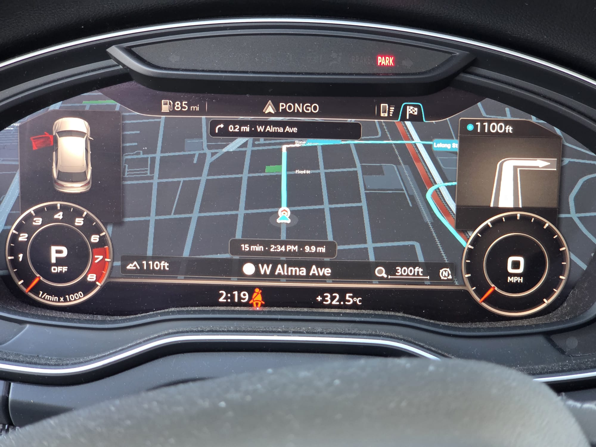
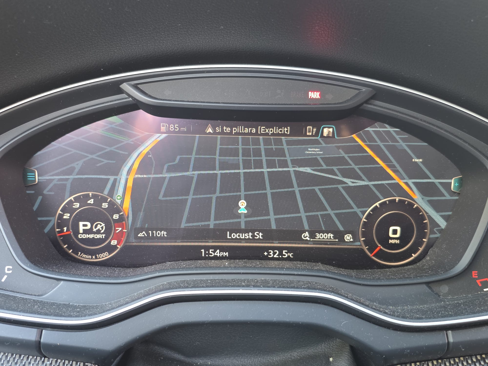
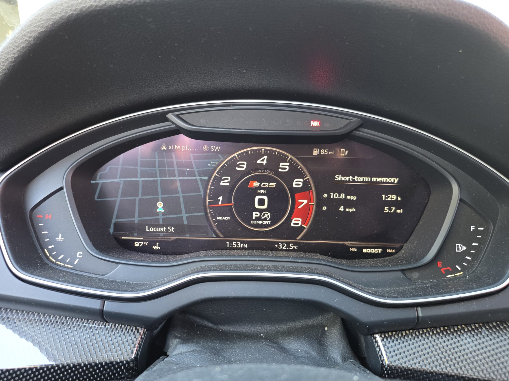
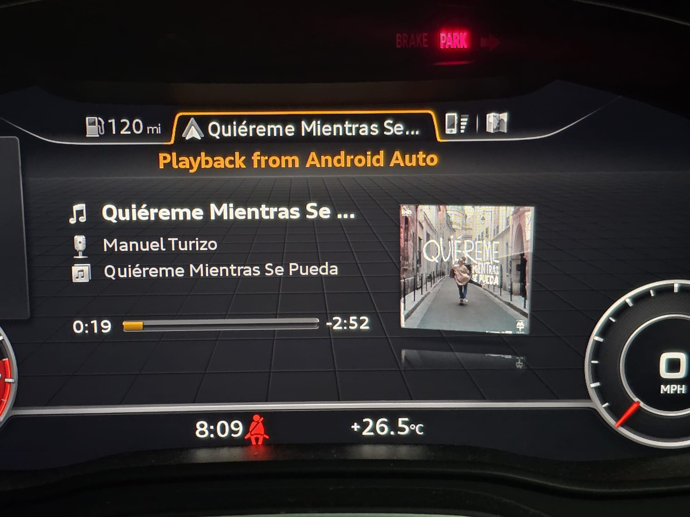
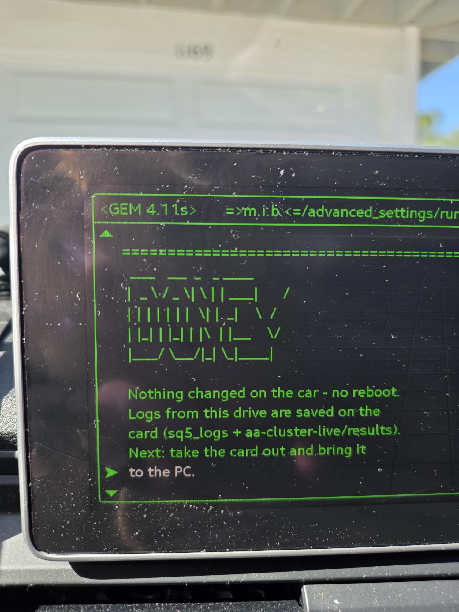

# MIB2Q Android Auto Cluster

<p align="center">
  
</p>

> [!IMPORTANT]
> This is an **Android Auto** project built from two earlier open-source foundations:
>
> - **[LuKa's stack](https://github.com/luka-dev/mib2q-carplay-rgi)** is the foundation for the HUD,
>   turn arrows, lane guidance, maneuver renderer and Virtual Cockpit window/context handling.
> - **[OneB1t/chopinwong01's approach](https://github.com/chopinwong01/mhi2-android-auto-video-vc)**
>   came first for Android Auto cluster video: hook the stock receiver, advertise a second cockpit
>   display and accept the phone's independent H.264 stream.
>
> This fork combines and ports those foundations to Audi MHI2Q, then adds the Qualcomm decoder,
> 1080p 1:1 viewport, live cockpit layouts, Android Auto event bridge, steering-wheel controls and a
> firmware-gated M.I.B. installer. Both upstream projects are credited, and LuKa's Git history remains
> connected through this fork.

> [!CAUTION]
> The ready installation profile is validated specifically on `MHI2Q_US_AUG22_P3639` **MU0918**.
> Other Audi MHI2Q releases should need only a focused compatibility port, but the included installer
> will refuse them until their native/Java seams and hashes are verified. Make a complete M.I.B. backup
> before modifying a head unit.

This project brings native Android Auto map video, route guidance and HUD integration to Audi MHI2Q.
It was developed and validated on a 2018 B9 SQ5 with the first-generation Virtual Cockpit.

The phone creates a real second Android Auto display and sends an independent H.264 stream on channel
64. The centre screen remains available for music, calls, messages or Android Auto's guidance list.
The cockpit picture is not a copy of the centre-screen framebuffer.

The hard reusable work is already implemented. Adapting another MHI2Q firmware normally means
verifying a small set of GAL/receiver ABI seams, regenerating the firmware-facing Java seams and adding
that firmware's hashes to a profile. The stream, decoder, layouts, HUD integration, controls, renderer,
tests and installer do not need to be reinvented.

## Contents

- [Gallery](#gallery)
- [Features](#features)
- [Comparison](#comparison)
- [Repository layout](#repository-layout)
- [Firmware compatibility and porting](#firmware-compatibility-and-porting)
- [Build](#build)
- [Deployment and installation](#deployment-and-installation)
- [Validation](#validation)
- [Known limits](#known-limits)
- [FAQ](#faq)
- [Attribution and license](#attribution-and-license)
- [Safety and rollback](#safety-and-rollback)

## Gallery

### Google Maps and Waze in action

Every photo and animation below is from Google Maps or Waze running through Android Auto on the
tested 2018 SQ5 with MU0918.

<p align="center">
  
  <br />
  <sub><b>Live cockpit switching</b> — the independent Android Auto map follows the active Audi layout</sub>
</p>

<table>
  <tr>
    <td width="33%" align="center">
      <br />
      <sub><b>Sport view</b> — independent map and compact guidance card</sub>
    </td>
    <td width="33%" align="center">
      <br />
      <sub><b>Large view</b> — Google card beside Audi's arrow tile</sub>
    </td>
    <td width="33%" align="center">
      <br />
      <sub><b>Full map</b> — native 1:1 cockpit viewport</sub>
    </td>
  </tr>
</table>

<table>
  <tr>
    <td width="50%" align="center">
      <br />
      <sub><b>Cockpit options</b> — size, position, arrow tile and resolution</sub>
    </td>
    <td width="50%" align="center">
      <br />
      <sub><b>Audi media integration</b> — Android Auto metadata and album art</sub>
    </td>
  </tr>
</table>

<details>
  <summary><b>M.I.B. logging and SD-card workflow</b></summary>
  <p align="center">
    
  </p>
</details>

The inherited CarPlay gallery remains in the repository as upstream history but is intentionally not
presented here as Android Auto evidence.

## Features

### Feature highlights

| | |
| --- | --- |
| 🖥️ **1080p independent cockpit stream**<br />A real second Android Auto display, separate from the centre screen. | ⚡ **30 fps hardware-decoded video**<br />Qualcomm H.264 decoding with automatic FFmpeg fallback. |
| 🔎 **Native cockpit sharpness**<br />1440×540 viewport shown 1:1 at the panel's physical 125 DPI. | 🧭 **HUD guidance**<br />Turn arrows, distance and lane information in Audi's head-up display. |
| 🎵 **Android Auto album art**<br />Cover art and metadata appear through Audi's native media screens. | 🎛️ **Hidden steering-wheel menu**<br />Change size, map position, arrow tile and resolution. |
| 🔄 **Live Audi layouts**<br />Large, Classic and Sport layouts switch without restarting Android Auto. | 🗺️ **Google Maps and Waze**<br />Both navigation apps are tested with live cockpit guidance. |
| ➡️ **Cockpit arrow tile**<br />Street, maneuver and 16-step distance bars with selectable behavior. | 🔌 **Wired and wireless**<br />Tested over direct USB and through a wireless Android Auto adapter. |

### Independent Android Auto cockpit display

- Separate 1920×1080 Android Auto cluster stream negotiated through GAL protocol 4.3.
- Google Maps and Waze render their own cockpit output while the centre screen remains independent.
- A 1440×540 phone viewport is presented 1:1 in the Virtual Cockpit without image scaling.
- Large, Classic and Sport views each receive their own layout and switch live through Android Auto
  message `0x8009`.

### Video pipeline

- Qualcomm `OMX.qcom.video.decoder.avc` hardware H.264 decoding.
- Automatic FFmpeg software-decoder fallback.
- Bounded encoded-frame queue, session recovery and reconnect handling.
- Approximately 29–30 frames per second decoded and 24–27 displayed in the normal 1:1 view.

### Cockpit and HUD guidance

- Turn arrows, street text, distance and lane information in the Virtual Cockpit and HUD.
- Cockpit arrow tile with 16-step approach bars and selectable always-on or Audi-style behavior.
- Route-start and route-end gating: Audi's native map remains when Android Auto is not navigating.
- LuKa's maneuver renderer, BAP guidance and cockpit context handling driven by Android Auto events.

### Driver controls and Audi integration

- Steering-wheel menu for UI size, map position, arrow tile and resolution.
- Five 1080p UI sizes: 95, 110, 125, 140 and 160 DPI; 125 DPI is the default.
- Steering-wheel roller adjusts car position in Large view and card layout in Sport view.
- MMI touchpad swipes navigate Android Auto while handwriting remains available.
- Android Auto album art appears through Audi's media picture path.
- Front PDC/parking behavior, automatic logging, per-feature off switches and exact uninstall rollback.
- Direct wired USB Android Auto and wireless Android Auto through a USB adapter are both tested.

## Comparison

Figures for this project are measured on the SQ5 or verified in its source and logs. RoadKernel details
are limited to the package and demonstrations examined during this research; unpublished values are
identified as such. LuKa's column describes the upstream CarPlay project rather than this fork's
Android Auto additions.

| Capability | This project | RoadKernel | [LuKa (CarPlay)](https://github.com/luka-dev/mib2q-carplay-rgi) |
| --- | --- | --- | --- |
| **Phone system** | Android Auto | Android Auto | CarPlay |
| **Live map in the cockpit** | Android Auto's own stream, independent of the centre screen | Independent of the centre screen | No projected map; guidance is drawn over Audi's native map |
| **Stream** | 1080p at 30 fps; 1440×540 viewport shown 1:1 | 720p at 30 fps, scaled | n/a |
| **Video decoding** | Qualcomm hardware decoder with automatic FFmpeg fallback | Hardware decoder | n/a |
| **Frames shown** | Approximately 24–27 of the 30 frames sent each second | Not published | n/a |
| **Sharpness and UI size** | 95/110/125/140/160 DPI at 1080p; 125 DPI default | Not published | n/a |
| **Cockpit views** | Large, Classic and Sport with live layout switching | Large, Classic and Sport | Guidance overlay follows supported Audi layouts |
| **Google card beside Audi's arrow tile** | Yes | Yes | n/a |
| **HUD** | Turn arrows, distance and lanes | No | Turn arrows and distance from CarPlay |
| **Cockpit arrow tile** | Arrow, street and 16-step distance bars; always-on or Audi-style | Stock Audi tile | Stock Audi tile |
| **Lane guidance** | Cockpit and HUD | Not published | Yes, from CarPlay |
| **Steering-wheel menu** | Size, position, arrow tile and resolution | No | No |
| **Day/night map** | Dark map only: Android Auto crashes on the Light theme for the cockpit display | Not published | n/a |
| **Map roller** | Adjusts car position in Large and card layout in Sport | No zoom | n/a |
| **MMI touchpad** | Menu swipes with handwriting retained | Not published | Not published |
| **Album art** | Android Auto cover art in Audi's media screens | Not published | Yes for CarPlay; this implementation builds on LuKa's work |
| **Navigation apps tested** | Google Maps and Waze | Google Maps | Apple Maps |
| **Firmware represented** | MU0918, tested on the car | MU1316 package examined | MU1316 releases; firmware-specific rebuilds may be required |
| **Installation** | M.I.B. SD card; audit, logs, off switch and exact rollback | SD card and rollback package; examined package tied to vehicle VIN | M.I.B. SD card |
| **Price and licence** | Free, GPL-3.0-or-later | Commercial, €100 when examined | Free; GPL-3.0 announced upstream and publication permission granted |

### Why 125 DPI

The first-generation Virtual Cockpit panel is 12.3 inches at 1440×540, approximately 125 pixels per
inch. The phone's viewport is shown 1:1, so 125 DPI puts Google's text, icons and lines on the panel at
their intended physical size without rescaling. The other size levels remain natively rendered and
sharp. Size changes apply on the next phone connection.

## Repository layout

| Path | Purpose |
| --- | --- |
| `android_auto/hook/` | GAL/libautoreceiver hook, channel transport, OMX/FFmpeg player and host tests |
| `android_auto/java/` | Android Auto event bridge, cockpit/HUD integration, controls and Java seams |
| `android_auto/deploy/` | Standalone GAL launcher and renderer supervision |
| `firmware/profiles/` | Public hashes and sizes for validated firmware; no firmware binaries |
| `install_AndroidAuto_MoreIncredibleBash/` | M.I.B. audit/install/uninstall entrypoint |
| `scripts/` | Compatibility checker, reproducible builds and SD-card staging |
| `common/`, `maneuver_render/`, `toolchain/` | Shared LuKa renderer and QNX build foundation |
| `assets/gallery/` | Android Auto evidence plus inherited upstream visual history |
| `docs/android-auto/` | Architecture, installation, porting and validation notes |

The inherited CarPlay implementation remains in the working tree as upstream reference so fixes can
still be contributed cleanly to LuKa. Android Auto packaging is isolated under the paths above; its
installer never deploys the CarPlay hook.

## Firmware compatibility and porting

| Firmware | Status | Work required |
| --- | --- | --- |
| `MHI2Q_US_AUG22_P3639` MU0918 | **Validated on the car; ready profile included** | Build with the owner's matching firmware JARs, stage and install |
| Other Audi MHI2Q releases | **Framework-compatible; profile verification required** | Verify native/Java seams, add hashes and test on that firmware |

### Already reusable across ports

- Secondary-display negotiation, channel 64 transport and channel 65 input.
- 1080p/720p configuration and live `0x8009` layouts.
- Hardware/software decode, frame queue and 1:1 presentation.
- Large, Classic and Sport viewport logic, menu and steering-wheel controls.
- Android Auto route-event translation into the cockpit, lane and HUD stack.
- Renderer, album art, touchpad and parking integration.
- Firmware checker, API/member gates, host tests, installer and rollback.

### Focused work for another firmware

1. Run the checker against `gal`, `libautoreceiver.so`, `lsd.jxe` and JARs obtained from that unit.
2. Confirm the receiver's interposed symbols, C++ object layouts and callback signatures. When they
   match MU0918, the native change may be profile-only.
3. Regenerate and review the three firmware-facing Android Auto Java seams. The build compares every
   replaced class header and public/protected member with the supplied stock JAR.
4. Confirm the Virtual Cockpit terminal, window IDs and display contexts, add hashes and POSIX
   checksums to a profile, then run the existing host and on-car validation sequence.

See [porting another firmware](docs/android-auto/firmware-porting.md). The installer refuses an
unverified version until this compatibility pass is complete; that protects the head unit and does
not mean the framework must be rewritten.

Run the read-only checker with files from the target unit:

```bash
python scripts/check_firmware.py \
  --gal /path/to/gal \
  --receiver /path/to/libautoreceiver.so \
  --lsd-jxe /path/to/lsd.jxe \
  --stock-jar /path/to/lsd.jar \
  --compile-jar /path/to/lsd_ic.jar
```

It reports `validated-profile`, `port-required`, `unsupported` or `incomplete`, and lists every change
the installer would make. Firmware binaries and converted stock JARs are never stored in this project.

## Build

The native build uses the QNX 6.5 ARMv7 Docker toolchain from
[`luka-dev/qnx65-armv7-toolchain`](https://github.com/luka-dev/qnx65-armv7-toolchain). Build that image
once, then run:

```bash
./scripts/build_android_auto_native.sh
./scripts/build_renderers.sh
./scripts/build_android_auto_java.sh \
  --stock-jar /private/path/lsd.jar \
  --compile-jar /private/path/lsd_ic.jar
python scripts/stage_android_auto.py
```

The Java inputs must be created locally from firmware the builder is entitled to use. The build checks
every replaced class against the stock JAR and fails when a class header or public/protected member
differs. Compile-only stubs are checked so they cannot enter the shipped overlay.

The staged SD-card tree is written to `dist/android-auto-card`. Build outputs and private firmware
inputs are ignored by Git.

## Deployment and installation

### Install with M.I.B.

1. Make a complete M.I.B. backup of the unit.
2. Build and stage the package, or obtain a package built against your exact validated profile.
3. Copy `install_AndroidAuto_MoreIncredibleBash` from `dist/android-auto-card` to the M.I.B. SD root.
4. Run M.I.B. → Advanced settings → Run custom script with no marker present. This is a read-only audit
   that prints firmware identity, current GAL launcher and the exact installation plan.
5. Continue only when the audit reports `VALIDATED MU0918 PROFILE` or the exact validated profile made
   for the unit. Create empty `mib2q_aa_install` in the SD root and run the custom script again.
6. Remove the marker, disconnect Android Auto and reboot the MMI.
7. Connect the phone and start a navigation route. With no Android Auto route, Audi's native map stays.

### Uninstall

Remove the install marker, create empty `mib2q_aa_uninstall` in the SD root and run the same custom
script. It verifies that the active configuration has not been externally changed, restores its saved
configuration and removes only files it installed. Remove the marker and reboot.

See [installation details](docs/android-auto/installation.md) and
[the exact on-unit change list](docs/android-auto/on-unit-changes.md).

## Validation

Validated on:

- 2018 Audi B9 SQ5 with first-generation Virtual Cockpit;
- `MHI2Q_US_AUG22_P3639`, MU0918;
- direct wired USB Android Auto;
- wireless Android Auto through a USB adapter;
- Google Maps and Waze.

Confirmed behavior includes the independent channel 64 stream, channel 65 input, GAL 4.3 negotiation,
1920×1080 video, 1440×540 1:1 viewport, Qualcomm decoding, live cockpit-view changes, route gating,
HUD/cockpit guidance, controls, reconnect recovery, stock-GAL fallback and package rollback.

Host coverage includes encoded-ring ownership/resynchronization, navigation translation, UiConfig
encoding, rotary input, Qualcomm tile conversion, menu geometry, Java member preservation, cluster
state transitions and installer refusal/rollback. See the [validation record](docs/android-auto/validation.md).

## Known limits

- **No true map zoom.** Android Auto does not expose a vehicle command for zooming its cockpit map.
  Resizing the layout moves the car in Large view or changes the card/layout in Sport view. Overall
  map and text scale comes from the Size setting.
- **Display rate.** The phone sends 30 fps and hardware decoding keeps up; approximately 24–27 fps
  reach the cockpit in normal use.
- **Reconnect-required settings.** Size and Resolution are negotiated when the phone connects. Arrow
  tile and map position apply live.
- **Arrow-button overlap.** Holding the right arrow to open the project menu can also open Audi's side
  menu because the cockpit receives that button independently.
- **Dark map only.** Android Auto on the phone crashes when the cockpit display is switched to the Light
  or Automatic theme (on-car test: the phone stopped answering and the whole link restarted), so the
  cockpit map always uses the Dark theme and the theme option was removed.

## FAQ

**Does it work on MHI2 rather than MHI2Q?** No. MHI2 is the older Nvidia-based K-train platform, such
as `MHI2_US_AUG22_K2162`. This project targets Qualcomm-based MHI2Q P-train firmware, and its receiver
hook and hardware decoder are specific to that platform.

**Does it work with another MHI2Q firmware?** The framework should transfer with a focused port. Run
the checker, verify the listed native/Java seams and create a validated profile before installation.

**Does it support CarPlay or MIB3?** This branch targets Android Auto on MHI2Q. For CarPlay guidance,
see [LuKa's project](https://github.com/luka-dev/mib2q-carplay-rgi). MIB3 is a different platform.

**Wired or wireless Android Auto?** Both are tested and use the same receiver/cockpit-stream pipeline.

**Which navigation applications are tested?** Google Maps and Waze. Other apps must implement Android
Auto's cluster-display interface to provide a cockpit map.

## Attribution and license

This repository is a fork of [`luka-dev/mib2q-carplay-rgi`](https://github.com/luka-dev/mib2q-carplay-rgi).
LuKa's project supplied the MHI2Q cockpit integration, renderer, build foundation and selected assets.
LuKa gave written permission on 2026-09-30 to publish and distribute these Android Auto modifications
as a fork.

The receiver hook adapts GPL-3.0 work from
[`chopinwong01/mhi2-android-auto-video-vc`](https://github.com/chopinwong01/mhi2-android-auto-video-vc).
FFmpeg is used under LGPL-2.1-or-later.

This project is published under GPL-3.0-or-later, subject to the third-party notices in
[`LICENSES/README.md`](LICENSES/README.md) and [`android_auto/THIRD_PARTY.md`](android_auto/THIRD_PARTY.md).
The private permission correspondence and email addresses are intentionally not published; its scope
is recorded in [`LICENSES/UPSTREAM-PERMISSION.md`](LICENSES/UPSTREAM-PERMISSION.md).

## Safety and rollback

The installer does not replace `gal`, `libautoreceiver.so`, `lsd.jxe` or `gal.json`. It adds the
Android Auto runtime under `/mnt/app/root/sq5_android_auto`, adds the Java overlay JAR and changes only
`children.gal.exec` and `children.gal.path` in `smartphone_integrator.json`.

Unknown firmware, a damaged payload, an existing third-party GAL launcher or an externally edited
installed configuration causes a refusal before activation or rollback. The stock-GAL off switch and
exact uninstall path remain available. Review [the on-unit change list](docs/android-auto/on-unit-changes.md)
before installation.
